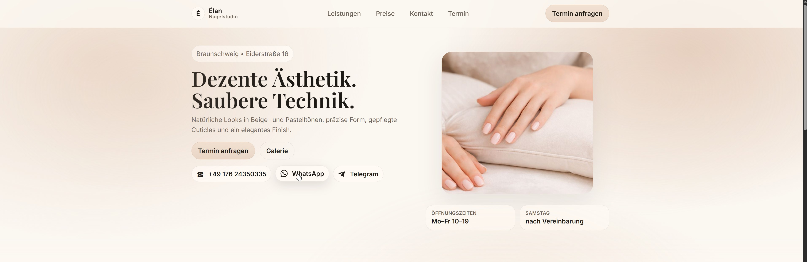
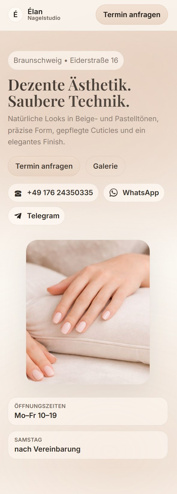
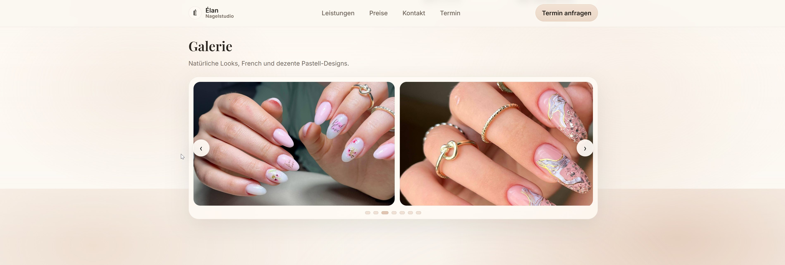
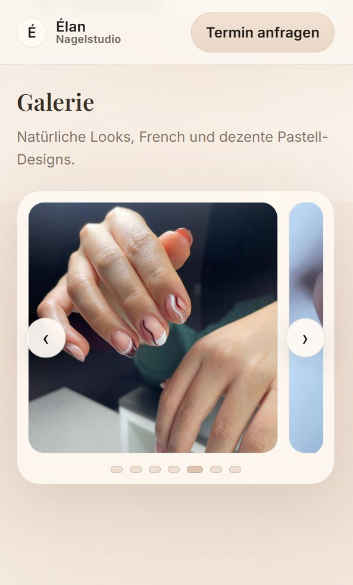
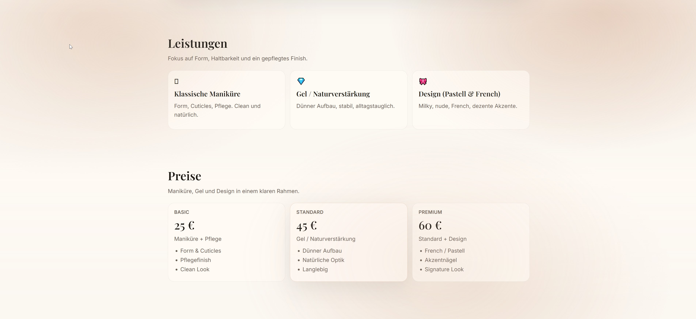
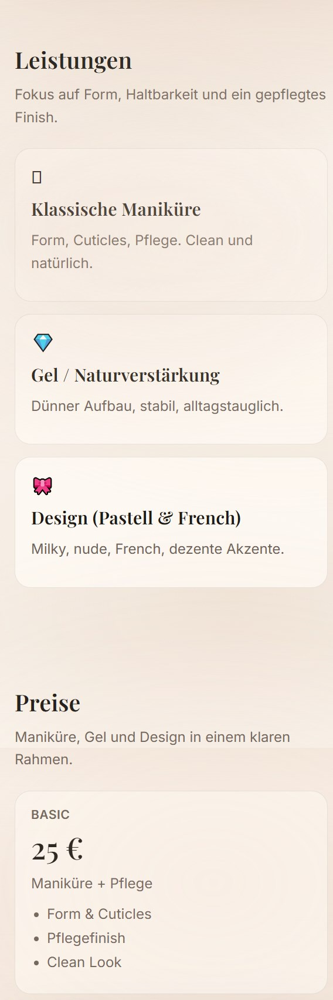
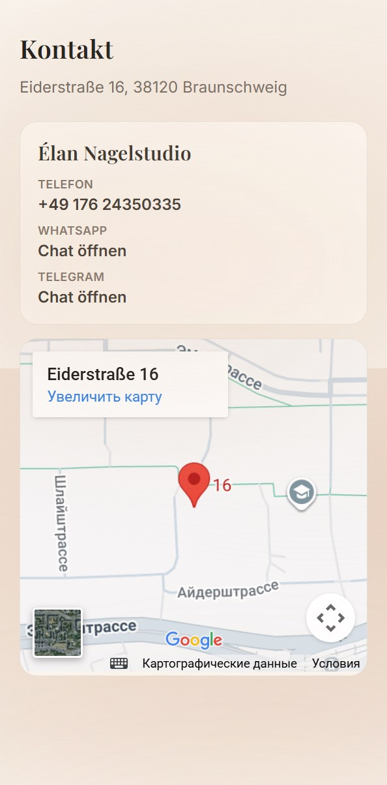
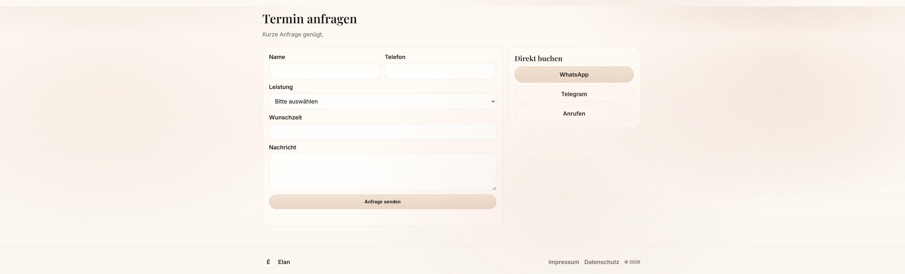
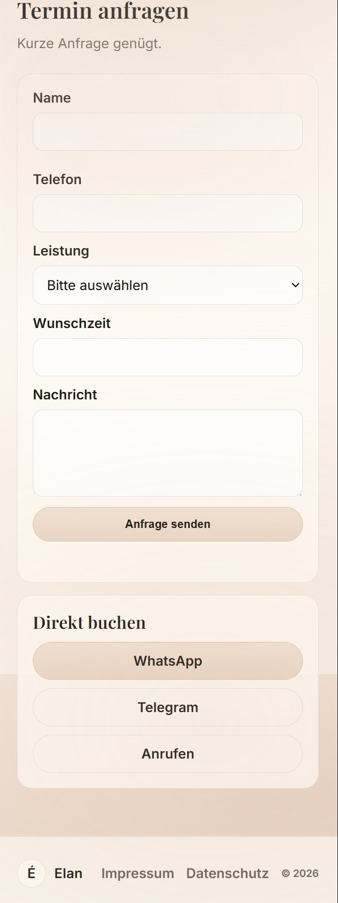

# Elan Nagelstudio — Responsive Demo Website

A responsive demo website for a nail studio in Braunschweig.  
The site is served as a static frontend using **Nginx** in **Docker**.

This project demonstrates clean layout structure, responsive design, and a simple deployment setup for a small business website.

---

## Features

- Fully responsive layout (mobile, tablet, desktop)
- Touch-friendly gallery carousel
- Contact options: phone, WhatsApp, Telegram
- Embedded Google Maps location
- Legal pages: Impressum and Datenschutz
- Clean structure and production-style file organization
- Docker-based local deployment

---

---

## Screenshots

### Desktop — Hero Section


### Mobile — Hero Section


### Desktop — Gallery Carousel


### Mobile — Gallery Carousel


### Desktop — Services & Pricing


### Mobile — Services & Pricing


### Desktop — Contact & Map


### Mobile — Contact & Map


### Desktop — Appointment Form


### Mobile — Appointment Form


---

## Tech Stack

- HTML5  
- CSS3 (responsive layout with media queries)  
- Vanilla JavaScript  
- Nginx (static file server)  
- Docker & Docker Compose  

---

## Run Locally (Docker)

### Requirements
Docker Desktop (with Docker Compose)

### Start the project

```bash
docker compose up -d
```

### Stop the project

```bash
docker compose down
```

### Open in browser

```
http://localhost:8080
```

---

---

## Live Demo

**Cloudflare Pages (Production):**  
https://nail-salon-docker-stack.pages.dev

This site is automatically deployed from the `main` branch via GitHub integration with Cloudflare Pages.

---

## Deployment (Cloudflare Pages)

**Platform:** Cloudflare Pages  
**Build type:** Static site  
**Build output directory:** `frontend`  
**Branch:** `main`

---


## Project Structure

```
frontend/                Static website files
├─ assets/
│  ├─ css/               Stylesheets
│  ├─ js/                JavaScript
│  └─ img/               Images
├─ datenschutz.html      Privacy policy
├─ impressum.html        Legal notice
└─ index.html            Main page

nginx/
└─ default.conf          Nginx configuration

docker-compose.yml       Docker setup
README.md                Project documentation
LICENSE                  License file
```

---

## Scope

This project is intentionally built as a **static demo website**.  
There is **no backend or database** included.

Appointment requests are handled via:

- Phone call  
- WhatsApp  
- Telegram  
- Email client (mailto link)

This keeps the project lightweight and suitable as a frontend portfolio example.

---

## License

This project is released under the MIT License.  
You are free to use, modify, and distribute it with attribution.
